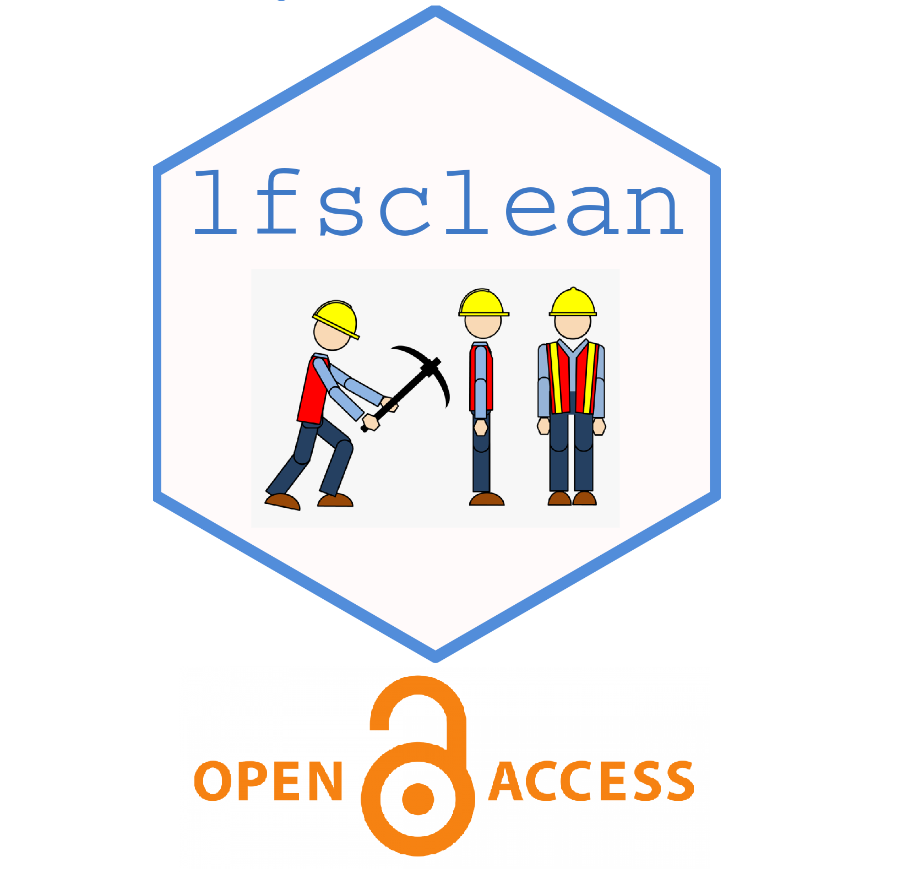

<!-- README.md is generated from README.Rmd. Please edit that file -->

```{r, include = FALSE}
knitr::opts_chunk$set(
  collapse = TRUE,
  comment = "#>",
  fig.path = "man/figures/README-",
  out.width = "100%"
)
```

# Quarterly Labour Force Survey data cleaning 

<!-- badges: start -->
[](https://www.repostatus.org/#active)
<!-- badges: end -->

## Motivation
The motivation for `lfsclean` is to develop a set of standard functions for processing raw data from the quarterly Labour Force Survey (LFS), which is an ongoing survey of households representative of the UK population primarily collecting demographic and labour market information such as employment status, earnings, and hours of work.

The `lfsclean` package contains functions which read in the raw data files, processes them into clean output variables, and combines all data files into a single output data table. The functions also create real-terms values for nominally valued monetary variables (earnings and wages), allowing the user to select either the CPIH or RPI.

## Installation

You can install the latest version of `lfsclean` from GitHub with:     

```{r gh_installation, message=FALSE, eval = FALSE}
#install.packages("devtools")
#install.packages("getPass")
#install.packages("git2r")

devtools::install_git(
  "https://github.com/STAPM/lfsclean.git", 
  build_vignettes = FALSE
)

```


## Citation

Cite this package as:

Morris, D (2023). lfsclean: An R package for cleaning UK Quarterly Labour Force Survey data. version [x.x.x]. University of Sheffield. https://doi.org/10.17605/OSF.IO/AHDNY

## Projects 

Some examples of projects making use of the `lfsclean` package are:

1. [Input-Output modelling](https://gitlab.com/SPECTRUM_Sheffield/projects/input-output-modelling). Here the package is used to create full-time equivalent employment by sector and year to estimate the impacts of changing demand in different sectors on total employment. 
